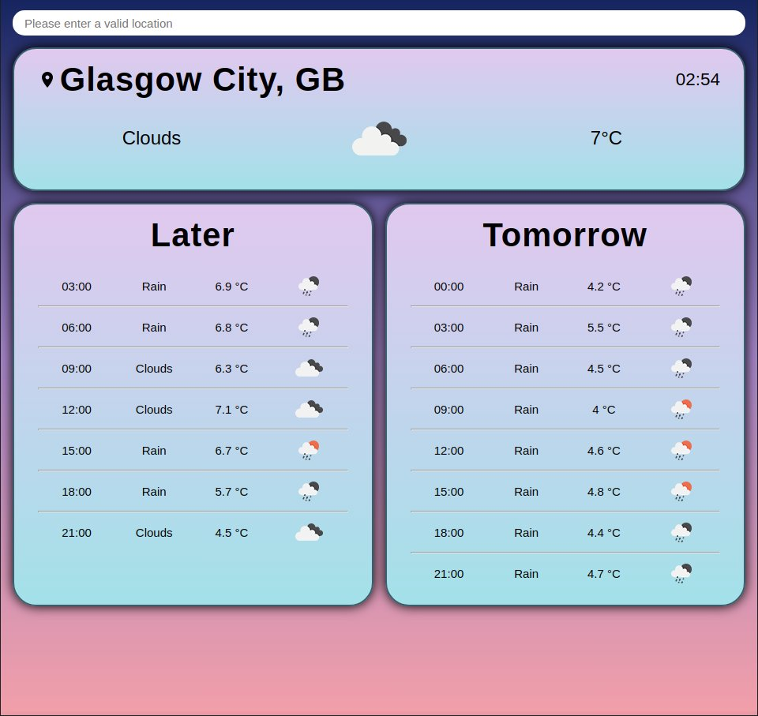

# Weather Forecast App

[See the project live](https://mckensis.github.io/weather-forecast)

## About the project

- Created to practice use of async/await
- Uses the OpenWeather 'Current Weather Data' and '5 Day / 3 Hour Forecast' APIs
- The site will display Glasgow's weather as default when the page is loaded

## How to Use

1. Enter a location in the search bar at the top
2. Press enter to search
3. Current weather for the location will display in the top section
4. Today's forecast for that location will display on the left section
5. Tomorrow's forecast for that location will display on the right section

## Screenshot

## Future Improvements

1. Swap over to a different API

    * Currently the 'Later' forecast will display data for later in the user's location when they make the API call, rather than the search location.
    * I.E. If you are in UK and search for a location in the US, the later forecast will be from the UK timezone rather than having data for the previous hours due to the earlier time in US.
    * This is unfortunately a limitation of the OpenWeather 5 Day / 3 Hour forecast API.

2. Display the weather for the user's current location when the page is loaded